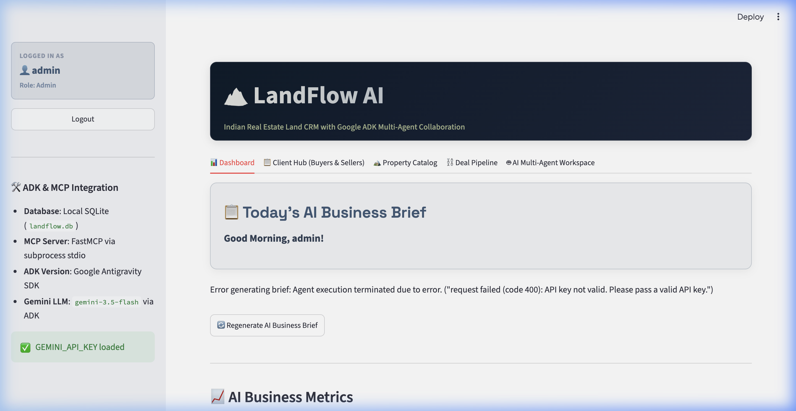
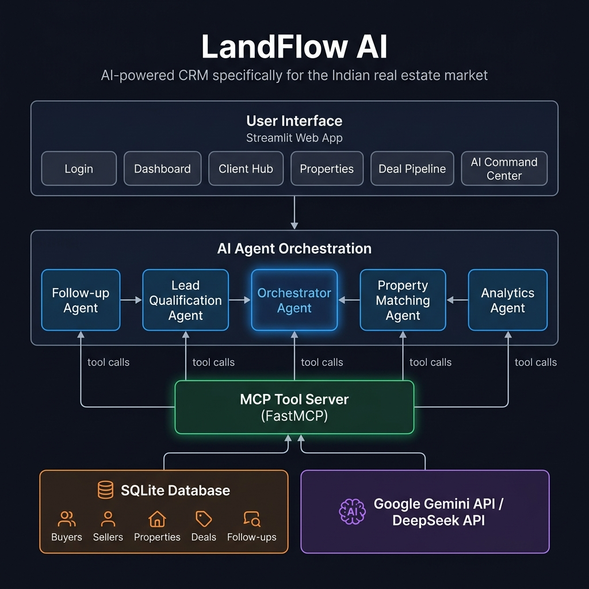

# 🏔️ LandFlow AI

> **AI-powered CRM for Indian real estate businesses** — replace Excel sheets, WhatsApp chats, and manual follow-ups with an intelligent multi-agent workflow.



---

## 🏗️ System Architecture



---

## ✨ Features

### 📊 AI Business Dashboard
- **Today's AI Business Brief** — Daily executive summary generated by the Analytics Agent
- Revenue Potential, Deals Closing This Week, Conversion Rate, Top Broker, Hot Locations
- Color-coded KPI cards with live data from SQLite

### 👥 Client Hub (Buyers & Sellers)
- Full CRUD for Buyers and Sellers
- **🤖 AI Insights** — Lead Score, Buying Intent, Likelihood of Closing, Risks, Timeline
- **📬 AI Communication Assistant** — Personalized WhatsApp, Email, Call Script, Meeting Agenda, Negotiation Talking Points

### 🏔️ Property Catalog
- Add, edit, delete land properties
- Status tracking (Available / Sold)
- Search and filter

### ⛓️ Deal Pipeline
- Kanban-style stage management (New Lead → Contacted → Site Visit → Negotiation → Documentation → Registration → Closed)
- Timeline tracking with activity logs

### 🤖 AI Command Center
- ChatGPT-style natural language interface
- Orchestrator Agent automatically routes to specialized sub-agents:
  - **Lead Qualification Agent** — Score and prioritize buyer leads
  - **Property Matching Agent** — Match buyers to the best properties
  - **Follow-up Agent** — Find missed follow-ups and inactive clients
  - **Analytics Agent** — Answer business questions about your pipeline
- Live tool call audit trail showing which agents and MCP tools were used

---

## 🛠️ Tech Stack

| Layer | Technology |
|-------|-----------|
| Frontend | Python + Streamlit |
| AI Agents | Google Antigravity SDK (ADK) |
| AI Models | Google Gemini / DeepSeek |
| Tool Server | FastMCP (stdio transport) |
| Database | SQLite |
| Auth | Username/Password (session-based) |

---

## 🚀 Getting Started

### 1. Clone the repository
```bash
git clone https://github.com/sisprasin/landflow-ai.git
cd landflow-ai
```

### 2. Create a virtual environment
```bash
python3 -m venv .venv
source .venv/bin/activate
```

### 3. Install dependencies
```bash
pip install -r requirements.txt
```

### 4. Add your API key
Create a `.env` file in the project root:
```env
# Google Gemini (free tier - recommended)
GEMINI_API_KEY="AIzaSy..."

# OR DeepSeek (requires paid balance)
# DEEPSEEK_API_KEY="sk-..."
```

Get a free Gemini API key at [aistudio.google.com/apikey](https://aistudio.google.com/apikey)

### 5. Run the app
```bash
streamlit run app.py --server.port 8502
```

Open [http://localhost:8502](http://localhost:8502) in your browser.

---

## 🔐 Default Login Credentials

| Username | Password | Role |
|----------|----------|------|
| `admin` | `admin123` | Admin |
| `broker1` | `broker123` | Broker |

---

## 📁 Project Structure

```
landflow-ai/
├── app.py              # Streamlit frontend (all pages)
├── agents.py           # AI agents (ADK + DeepSeek support)
├── database.py         # SQLite database layer
├── mcp_server.py       # FastMCP tool server
├── requirements.txt    # Python dependencies
├── verify_setup.py     # Setup verification script
├── docs/
│   ├── architecture.png   # System architecture diagram
│   └── dashboard.png      # Dashboard screenshot
└── .gitignore
```

---

## 🤖 AI Agent Workflow

```
User Query
    ↓
Orchestrator Agent
    ↓ routes to ↓
┌──────────────────────────────────┐
│  Lead Qualification Agent        │
│  Property Matching Agent         │
│  Follow-up Agent                 │
│  Analytics Agent                 │
└──────────────────────────────────┘
    ↓ tool calls via MCP ↓
FastMCP Tool Server
    ↓
SQLite Database
```

---

## 📄 License

MIT License — feel free to use, modify, and build on this project.
