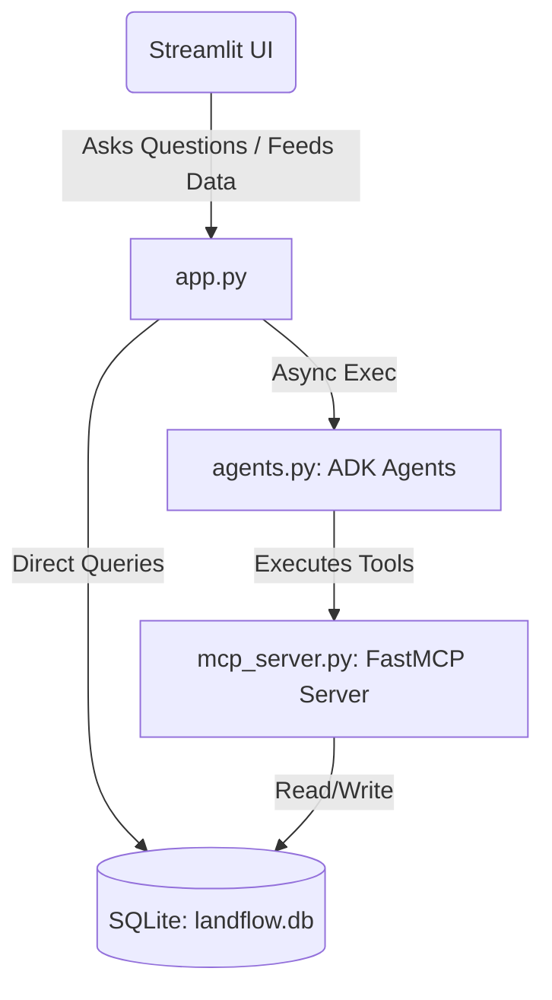

# LandFlow AI — AI-Powered CRM & Multi-Agent Workspace

**LandFlow AI** is a lightweight, modern, AI-powered CRM designed for Indian real estate businesses that buy and sell land. Built as a demo for the **Kaggle AI Agents Capstone**, it replaces manual spreadsheet management and unstructured follow-ups with an integrated system of database utilities, local MCP tools, and specialized Google Agent Development Kit (ADK) agents.

---

## 🏛️ Architecture Overview

The system consists of three main components:
1. **SQLite Database (`database.py`)**: Stores Buyers, Sellers, Properties, Deals, Timeline Activities, and Follow-ups. Pre-seeded with 10 Buyers, 10 Sellers, 20 Properties, and 15 Deals for immediate functionality.
2. **FastMCP Server (`mcp_server.py`)**: A local Model Context Protocol server exposing CRM tool handles (`search_buyers`, `search_sellers`, `search_properties`, `update_deal_stage`, `add_followup`, `get_dashboard_stats`) over Stdio.
3. **ADK Multi-Agent Team (`agents.py`)**: Four agents built using the Google Antigravity SDK (`google-antigravity`) that communicate through the MCP server to automate everyday broker workflows.



---

## 🤖 The AI Brokerage Team (ADK Agents)

Each agent in [agents.py](file:///Users/ashish/Documents/project/agents.py) is initialized with specialized instructions and attached to the local MCP tools server:

1. **📋 Lead Qualification Agent**:
   - **Role**: Analyzes new buyer text inquiries (e.g., from WhatsApp or web forms).
   - **Logic**: Inspects contact details, location preferences, and budgets.
   - **Output**: Generates a structured report with a **Lead Score (0-100)**, **Priority (High, Medium, Low)**, explanation, and immediate action steps.
2. **🎯 Property Matching Agent**:
   - **Role**: Automates match-making between buyer specifications and available land.
   - **Logic**: Uses the `search_properties` MCP tool to filter listings based on budget limits and area sizes.
   - **Output**: Recommends the 5 best properties from the catalog, explaining why they are suitable.
3. **🕒 Follow-up Agent**:
   - **Role**: Automatically auditing pipelines to prevent deal staleness.
   - **Logic**: Scans follow-ups and deals to find missed tasks or inactive pipelines (no updates for 7+ days).
   - **Output**: Synthesizes a prioritized daily todo list of specific client follow-ups for the broker.
4. **📊 Analytics Agent**:
   - **Role**: A natural language query interface for business operations.
   - **Logic**: Reads aggregate stats (`get_dashboard_stats`) and lists (`search_buyers`, `search_sellers`).
   - **Output**: Answers broker queries like *"Which broker has the most active deals?"* or *"Average asking price in Sector 150."*

---

## 🚀 Setup & Execution Instructions

Follow these steps to run LandFlow AI locally.

### 1. Prerequisites
- **Python**: Version 3.10 or higher.

### 2. Set Up Virtual Environment & Dependencies
Create a virtual environment and install dependencies:
```bash
# Create and activate environment
python3 -m venv .venv
source .venv/bin/activate

# Install requirements
pip install -r requirements.txt
```

### 3. Configure Gemini API Key
Add your Gemini API key to a `.env` file in the project root:
```bash
echo "GEMINI_API_KEY=your_gemini_api_key_here" > .env
```
*(You can get a free API key from [Google AI Studio](https://aistudio.google.com/app/api-keys).)*

### 4. Verify the Database & Tools
Run the verification script to initialize and seed the database, and verify the FastMCP tools:
```bash
python3 verify_setup.py
```

### 5. Run the CRM Application
Start the Streamlit interface:
```bash
streamlit run app.py
```
Open your browser to the URL shown in the terminal (typically `http://localhost:8501`).

---

## 🔐 Authentication Credentials
The application requires logging in. Use these seed credentials:
- **Admin Role**: Username: `admin` | Password: `admin123` *(Has full CRUD + Delete permissions)*
- **Broker Role**: Username: `broker1` | Password: `broker123` *(Has CRUD permissions; deletes are blocked)*
- **Broker Role**: Username: `broker2` | Password: `broker456`
